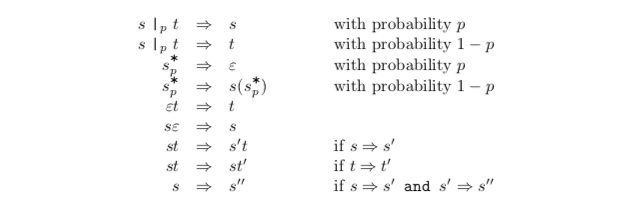
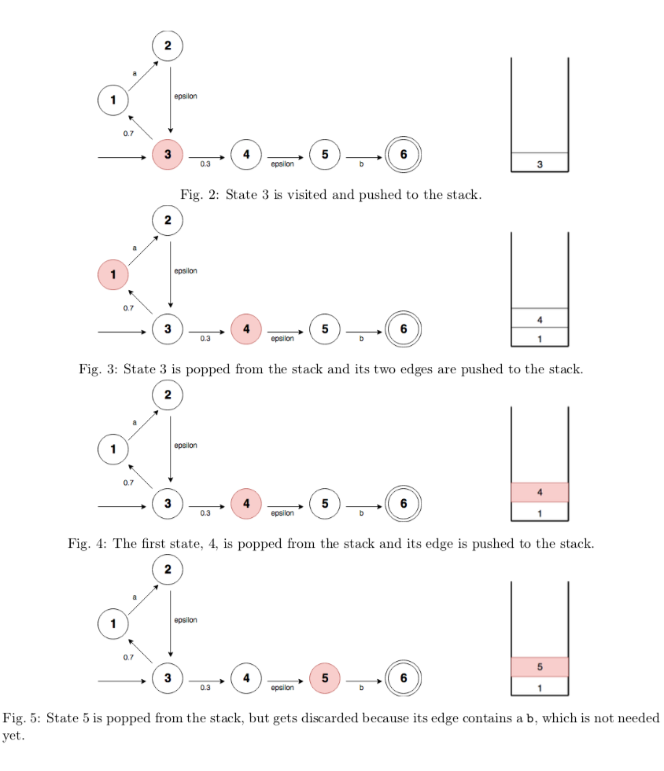
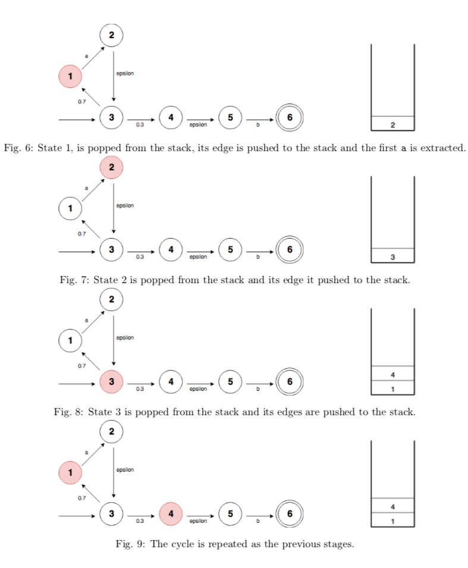

# Probabilistic Regular Expressions

This small project was one out of four exam tasks for the course *Programming Language Design* at the Department for Computer Science, University of Copenhagen.

The given task was to create a variant of regular expressions that assign probabilities to choices, implying that every string has a probability between 0 and 1 of being generated by the regular expression. In which the choice operator `|` and the Kleene star `*` are marked with a probability. The choice operator has the probability of choosing the left choice, and the Kleene-star, has the probability of exiting the repetition. Described in terms of the following derivation:



## Further Explorations

1.  Creating the `?`, which gives zero or one of an expression. It can be useful if the goal is to check the occurrence of zero or one.

2. Creating the `+`, giving one or more of an expression. It is beneficial if one wants to check the occurrence of one or more of a given expression.

3. Having that`a{3}` gives precisely three of a. It is useful to create an exact number of occurrence or check if there exists a precise number of occurrences of a given character.

4. Implementing the same in, e.g. Haskell or F\#. 


## How to run the code

To run the program, it is necessary to have Python 3.x installed. 

### Running the Tests
`python tests.py`


### Creating regular expressions: 
Start by importing `parser.py` as such: `import parser as ps`
This can be done in a file or the interactive mode.

Creating a symbol: 
`ps.sym('a')`

Concatenating two NFAs: 
`ps.conc(ps.sym('a'), ps.sym('b'))`

Using choice:
`ps.choice(0.3, ps.sym('a'), ps.sym('b'))`

Using star:
`ps.star(0.3, ps.sym('a'))`


### Examples of `regex`: 
```
    a *0.3 b

    ps.conc(ps.star(0.3, ps.sym('a')), ps.sym('b'))


    (a |0.2 b |0.3 c |0.4 d |0.5 r)*0.2

        ps.star(0.2, ps.choice(0.2, ps.sym('a'), 
        ps.choice(0.3, ps.sym('b'), ps.choice(0.4, 
        ps.sym('c'), ps.choice(0.5, ps.sym('d'), ps.sym('r'))))))
```

## Semantics that Finds the Probability of Deriving a Given String

### Design Choices
To find the probability of deriving a given string of a given NFA, my choice of design was using a stack. As an example, using the 
regular expression $a \*_{0.3} b$, we would get the NFA:

```
	{1: [(2, 1.0, 'a')], 
	2: [(3, 1.0, 'epsilon')], 
	3: [(1, 0.7, 'epsilon'), (4, 0.3, 'epsilon')], 
	4: [(5, 1.0, 'epsilon')], 
	5: [(6, 1.0, 'b')], 
	6: []}
```

Which can be visualized as such:


We want to find the string `aaab`. The procedure below shows how this is done. Note that the implementation multiplies the probability along the way and sums all possible paths at the end, this is however not displayed in the visualization below. 







This procedure will continue until the string is matched.


